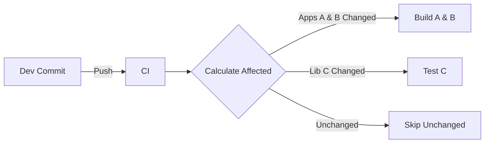

# CI/CD Pipeline Strategy

**Version**: 1.0.0
**Context**: Monorepo Build & Deployment

---

## 1. Pipeline Philosophy

We use **Nx Affected** commands to only build, test, and lint what has changed. This ensures rapid feedback and optimal resource usage.

### 1.1 The "Affected" Workflow

Nx calculates the "affected graph" based on the Git diff between the current branch and `main`.



---

## 2. CI Pipeline Stages

### 2.1 Stage 1: Validation

Runs on **Pull Request**.

1.  **Install**: `npm ci`
2.  **Lint Affected**: `nx affected:lint`
3.  **Test Affected**: `nx affected:test` (Unit Tests)
4.  **Build Verification**: `nx affected:build` (Ensure it compiles)

### 2.2 Stage 2: Artifact Generation

Runs on **Merge to Main**.

1.  **Version**: Semantic versioning bump.
2.  **Build**: `nx build {app} --configuration=production`
3.  **Artifacts**: Store `dist/apps/{app}` as a ZIP/Docker Image.

### 2.3 Stage 3: Deployment

Runs on **Manual Trigger** or **Tag**.

- **Dev**: Auto-deploy from `main`
- **Staging/Prod**: Promotion of existing artifact.

---

## 3. Sample Pipeline Configuration (GitHub Actions)

```yaml
name: CI/CD
on:
  push:
    branches: [main]
  pull_request:

jobs:
  validate:
    runs-on: ubuntu-latest
    steps:
      - uses: actions/checkout@v4
        with:
          fetch-depth: 0 # Required for Nx Affected
      - uses: actions/setup-node@v4
        with:
          node-version: 20
      - run: npm ci
      - run: npx nx affected -t lint test build
```

---

## 4. Deployment Strategy per App

### 4.1 Shell Deployment

- **Type**: Static Hosting (S3/CloudFront, Azure Static Web Apps, Nginx).
- **Critical**: Must have `module-federation.manifest.json` updated with correct Remote URLs.

### 4.2 Remote Deployment

- **Type**: Static Hosting.
- **Independence**: Remotes are deployed **independently**.
- **CORS**: Must allow Cross-Origin requests from Shell Domain.

---

## 5. Secret Management

- **Environment Variables**: Use `src/environments/environment.ts` for non-secrets.
- **Secrets**: Inject during CI build time via `envsubst` or similar tools into `assets/config.json` if needed for runtime config.

## 6. Caching

- **Local**: Nx caches to `node_modules/.cache/nx`.
- **Remote**: Enable **Nx Cloud** to share cache across the team and CI nodes (Optional but recommended).
