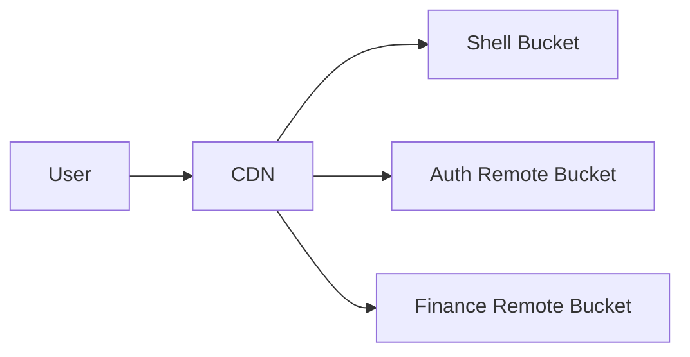

# Deployment & Hosting Strategy

**Version**: 1.0.0
**Focus**: Micro-Frontend Dynamic Loading

---

## 1. Dynamic Remote Discovery

We do **not** hardcode Remote URLs in the Shell's build. Instead, we use a **Manifest-based approach** to resolve Remotes at runtime.

### 1.1 The Manifest File

A JSON file (`assets/module-federation.manifest.json`) maps Remote names to their deployed URLs.

**Example**:

```json
{
  "remote-auth": "https://auth.erp.com",
  "remote-finance": "https://finance.erp.com",
  "remote-hr": "https://hr.erp.com"
}
```

### 1.2 Runtime Resolution

1.  **Shell Boot**: Fetches `manifest.json`.
2.  **Lookup**: When a route is requested, Shell looks up the URL.
3.  **Load**: Fetches the `remoteEntry.js` from that URL.

**Advantage**: We can update Remote URLs (e.g., pointing to a new version) without rebuilding the Shell.

---

## 2. Infrastructure Architecture

Remotes are hosted as independent static sites.



### 2.1 CORS Configuration

Since the Shell loads scripts from Remote domains, **Remotes must enable CORS**.

- **Access-Control-Allow-Origin**: `https://shell.erp.com` (or `*` if public)
- **Access-Control-Allow-Methods**: `GET, OPTIONS`

---

## 3. Versioning Strategy

### 3.1 Immutable Builds

Every deployment of a Remote should be immutable.

- `https://remotes.erp.com/auth/v1.0.0/`
- `https://remotes.erp.com/auth/v1.0.1/`

### 3.2 "Blue/Green" Rollout

Update the Shell's `manifest.json` to point to the new version only when verified.

1.  Deploy `v1.0.1` to storage.
2.  Test `v1.0.1` directly.
3.  Update Shell Manifest: `"remote-auth": ".../v1.0.1"`.

---

## 4. Rollback Strategy

Because the Shell depends on the Manifest:

1.  **Instant Rollback**: Revert `manifest.json` to point back to the previous version URL.
2.  **No Rebuild**: Shell does not need a redeploy, just a config refresh.

---

## 5. Environment Handling

Different environments have different Manifests.

- **Dev**: `localhost` ports.
- **Staging**: `*.staging.erp.com` URLs.
- **Prod**: `*.erp.com` URLs.

This selection happens at **Runtime** based on the domain or an injected environment variable.
