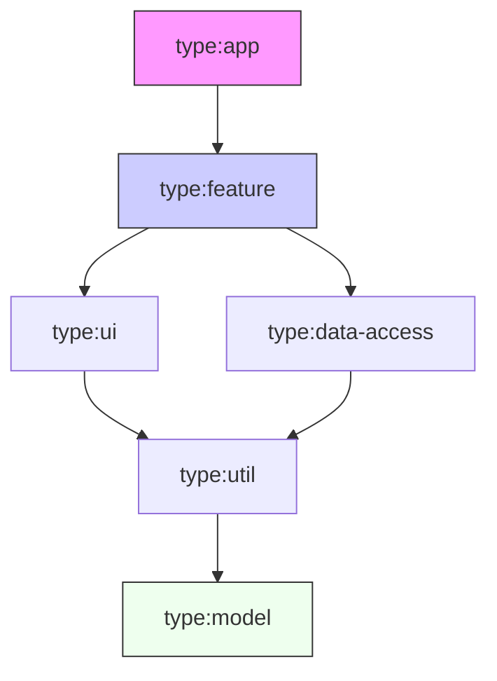

# Workspace Structure & Nx Implementation

**Version**: 1.0.0
**Status**: APPROVED

---

## 1. Directory Structure

We strictly separate **apps** (deployables) from **libs** (logic).

### 1.1 Root Layout

```text
erp/
├── apps/                # DEPLOYABLE ARTIFACTS
│   ├── shell/           # The Host Application
│   └── remote-*/        # Remote Applications
├── libs/                # SOURCE CODE & LOGIC
│   ├── shared/          # Shared across all domains
│   ├── auth/            # Auth Domain Key Logic
│   ├── finance/         # Finance Domain Key Logic
│   └── ...
├── tools/               # Custom workspace generators
├── nx.json              # Workspace Configuration
└── tsconfig.base.json   # Global TypeScript Config
```

---

## 2. Library Strategy

We use a **library-first** development approach. Apps are just composition layers.

### 2.1 Library Types

| Type            | Folder Path                   | Content                                        | Tag                |
| --------------- | ----------------------------- | ---------------------------------------------- | ------------------ |
| **Feature**     | `libs/{scope}/feature-{name}` | Smart Smart components, Routes, Business Logic | `type:feature`     |
| **Data Access** | `libs/{scope}/data-access`    | Services, State Mgmt, HTTP                     | `type:data-access` |
| **UI**          | `libs/{scope}/ui`             | Dump Components, Design System                 | `type:ui`          |
| **Utils**       | `libs/{scope}/utils`          | Pipes, Validators, Helpers                     | `type:util`        |
| **Models**      | `libs/{scope}/models`         | Interfaces, Types, Enums                       | `type:model`       |

### 2.2 Naming Conventions

- **Directory**: `libs/finance/feature-invoicing`
- **Import Path**: `@erp/finance/feature-invoicing`
- **Selector**: `erp-finance-invoicing`

---

## 3. Boundary Enforcement (Nx Tags)

We rely on `nx lint` to enforce architectural boundaries.

### 3.1 Tag Schema

Every project in `project.json` MUST have:

1.  **Scope Tag**: `scope:shared` | `scope:auth` | `scope:finance` ...
2.  **Type Tag**: `type:app` | `type:feature` | `type:ui` ...

### 3.2 Dependency Rules (`nx.json`)

Dependencies are restricted to prevent circular refs and ensure clean architecture.



**Scope Rules**:

- `scope:auth` CANNOT import `scope:finance`
- `scope:finance` CANNOT import `scope:auth`
- ANY Scope can import `scope:shared`

---

## 4. Code Quality

### 4.1 Strict TypeScript

Enabled in `tsconfig.base.json`:

```json
"compilerOptions": {
    "strict": true,
    "noImplicitAny": true,
    "strictNullChecks": true,
    "strictPropertyInitialization": true
}
```

### 4.2 Linting & Formatting

- **Linter**: ESLint (Flat Config)
- **Formatter**: Prettier (2 spaces, single quotes)
- **Command**: `nx lint {project}` checks both code style and module boundaries.

---

## 5. Generators

Use these commands to generate standard libraries:

**Generate UI Lib**:

```bash
nx g @nx/angular:lib shared-ui --directory=libs/shared/ui --tags=scope:shared,type:ui
```

**Generate Feature Lib**:

```bash
nx g @nx/angular:lib auth-feature-login --directory=libs/auth/feature-login --tags=scope:auth,type:feature
```
